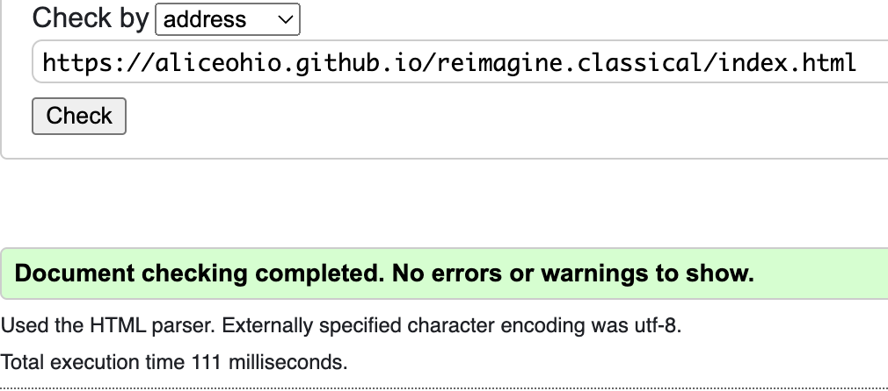

# Reimagine classical 

[Reimagine classical](https://aliceohio.github.io/reimagine.classical/) is a site for people who are interested in classical music but who may have never found the right music to fit their personal musical taste. 

Remembering the days of music recordings being available on vinyl, then the transition to tape cassettes, then on to cds and now to the multiple music apps where one can listen to everything, sometimes the choices are overwhelming.

As a classical music lover and musician I get frustrated by poor performances and I've yet to find an online music app that offers consistent good recordings from top-notch musicians. 

When you think of Debussy or Mozart you don't want to hear just anyone perform. What is it that makes a recording great as compared to just okay? It's about the performer's intimate knowledge of the piece they are performing, the hours of practice, the life experiences conveyed through the music. Music is not just about listening but about feeling. You should be able to feel the emotion of the musician coming through when you are listening (think of a live concert by your favorite artist vs an instrumental version you might hear in the elevator - one will definitely put you to sleep!)

My goal through this website is to create a service in which I help you to experience the same passion I have for classical music by creating a specific collection of classical pieces based on your current listening preferences. By asking a few questions initially, and through our contact after you fill out the "let's talk" form, I will take time to curate your individualized playlist.

## FEATURES

### Existing features:

- The Navigation Bar

    - The fully responsive navigation bar includes links to the home page, facts about classical music, about me and a let's talk section and is consistent throughout the website for easy navigation.

    - The navigation bar allows the user to move easily from one page to another, across all devices and layouts (portrait or landscape) without having to us the 'back' button.

    
    
- The Landing Page

    - The landing page image is a pair of over-the-ear headphones with the logo of reimagine classical over the image.
    - There is a brief tag directly under clarifying the branding information.

    

- The Footer

    - The footer section allows the user to visit my personal page on relevant social media sites, including my CV on linkedin. The links open in a new tab to allow for simplified user navigation.

    

- The Favicon

    - The favicon represents a simple image of the first two letters of the concept, reimagine classical, and is featured on every page.

    

- The Classical Facts Page

    - The classical facts page shows six various images of musical instruments, musical devices (a metronome) and written music itself. 
        - On large screens, the images are clear and bright with no filter used.
        - On smaller screens, the images are blurred and have an overlay so the classical facts can be easily read.

    - The classical facts includes various facts about the advantages to listening to classical music, including its effects on heart health, psychological health, breathing rates, neurological advantages as well as its use in the treatment of pain.

        - On large screens, the facts present themself only with the use of a hover effect.
        - On smaller screens, the facts present themselfs without use of hover.

    

    

- The About Me Page

    - The about me page is a brief overview of who I am, including my musical background as well as why I believe listening to classical music is beneficial to everyone.
    
    - This page includes two working hyperlinks, both of which open in new windows, for user ease.
        - The first link is an external link to a biography of a music teacher.
        - The second link in an internal link to the "let's talk" page to encourage interaction with the user.

    

- The Let's Talk Page

    - The let's talk page allows the user to share with me a bit more about their current music preferences to provide a base for the initial contact.

    - The let's talk page uses an image of a vinyl record in the background with a transparent overlay so the text can be easily read.

    - The let's talk page includes:
        - a datalist dropdown menu for pronoun usage,
        - a text input for name,
        - a required email input,
        - a checkbox with four options for musical style preferences,
        - a textarea input for any additional information the user would like to share,
        - a submit button, and
        - a custom thank you for contacting me page.

    

    

- The 404 Not Found Page

    - There is a custom 404 not found page which provides a link back to the landing page. 
        - The link does not open in a new window as it functions as a return.

    

## Testing
In this section, you need to convince the assessor that you have conducted enough testing to legitimately believe that the site works well. Essentially, in this part you will want to go over all of your project’s features and ensure that they all work as intended, with the project providing an easy and straightforward way for the users to achieve their goals.
In addition, you should mention in this section how your project looks and works on different browsers and screen sizes.
You should also mention in this section any interesting bugs or problems you discovered during your testing, even if you haven't addressed them yet.
If this section grows too long, you may want to split it off into a separate file and link to it from here.

- Social media links function properly (open in new window, on the respective website).

- All inputs function properly, with the form inputs of name and email being required.

- All hover effects function properly.

- Links to external websites open in a new page.

- Links internally funciton properly.
 
- Responsive design testing was done on the following devices to ensure functionality: 
    - iphone SE, XR, 8
    - ipad 8
    - macbook 13"
    - dell 14"
    - Android cell phone
    - Kindle fire tablet
    - Wide-screen laptop

### Validator Testing
- HTML
    - The Landing Page
        - No errors were returned when passing through the official W3C validator
        
    - The Classical Facts Page
        - No errors were returned when passing through the official W3C validator
        
    - The About Me Page
        - No errors were returned when passing through the official W3C validator
        
    - The Let's Talk Page
        - No errors were returned when passing through the official W3C validator
        
    - The Contact Page
        - No errors were returned when passing through the official W3C validator
        
    - The 404 Not Found Page
        - No errors were returned when passing through the official W3C validator
        

- CSS
    - No errors were found when passing through the official (Jigsaw) validator
    

### WAVE Testing
- There were no errors nor alerts throughout the website using WAVE (the web accessibility evaluation tool).

### Lighthouse Testing
- The entire website scored very well throughout, with accessibility consistently at 100%.

- The Landing Page

    

- The Classical Facts Page

    

- The About Me Page

    

- The Let's Talk Page

    

### Unfixed Bugs

Using only CSS and HTML limits the number of music styles in the Let's Talk Page without affecting User Experience. Additionally, I am limited to how the checkbox and label wrap using only CSS and HTML (i.e. not wrapping together because the code doesn't see the checkbox and its corresponding label as one unit). I limited the number of styles (initially there were 8) due to problems with UX and wrapping, but the checkbox is still not linked to the label at certain screen sizes.

Additionally, due to the limitations of HTML and CSS, I created a custom thank you form.

## Deployment

- This website was deployed to GitHub page using the following steps:
    - In the GitHub respository, navigate to the Settings tab
    - Open the Pages Section
    - Under the Branch Section, click on the dropdown Select Branch and change to Main
    - Once the Branch has been changed to Main, refresh the page to have a ribbon at the top indicating successful deployment (and the web address) 

The live link can be found here - https://aliceohio.github.io/reimagine.classical/

## Credits

- The basic framework was inspired by the Love Running project by Code Institute (https://github.com/Code-Institute-Org/love-running-2.0)
- The button was designed using code from developer.mozilla.org (https://developer.mozilla.org/en-US/docs/Web/HTML/Element/button)
- The footer html code was taken directly from the Love Running Project by Code Institute.
- Additional methodologies / techniques (ie flexbox, grid, text fading in over image with an overlay on that image) were acquired from YouTube videos from either Kevin Powell (https://www.youtube.com/@KevinPowell) or Kyle at webdevsimplified (https://www.youtube.com/c/webdevsimplified)
- I am very thankful to my mentor, who provided me not only with many online resources to ensure accessibility and accuracy in my code, but also gave me additinal hints and tips for refinement. Thanks Gareth!

## Media

- The images throughout the website were taken from Pexels.com
- The footer icons were taken from Font Awesome
- The favicon was created using favicon.io

